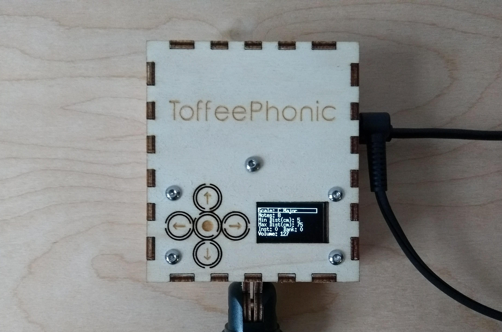
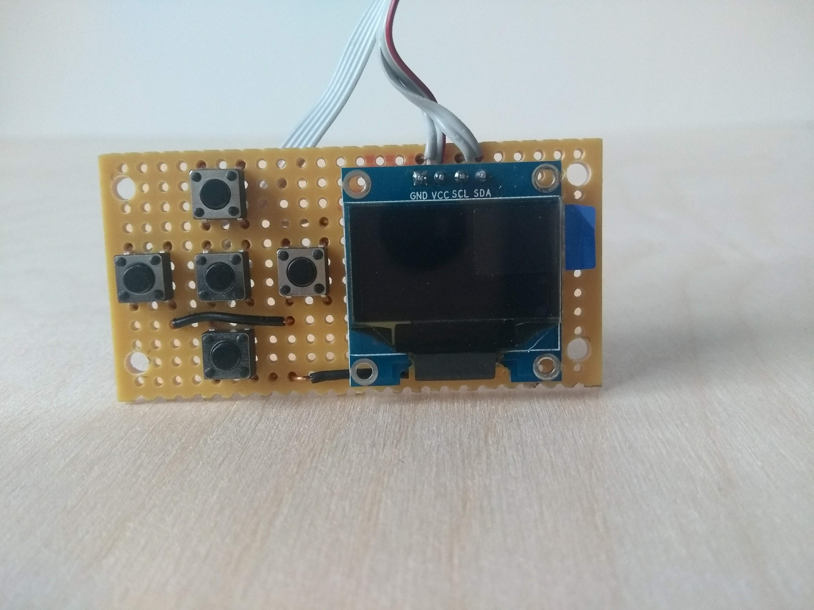

## Build guide

Menu Breakout (this will hopefully be replaced by a single PCB in future versions):

1. Cut/snap a piece of copper stripboard (0.1" spacing) so you have 24 x 12 holes to work with, with the strips running in the direction of the short sides. We will be placing the components on this board as shown.




1. Drill (to 3mm) the 4 holes at (1,2), (24,2), (1,11), and (24,11) - as pictured.


1. Put the buttons in place (don't solder them yet), with their top left pins in positions (1,5), (5,1), (5,5), (5,9), (9,5), as pictured in the first image.


1. Carefully, cut the copper tracks with the craft knife: between holes (5,4) and (5,5); and (5,8) and (5,9) (highlighted in the picture).


1. Solder the buttons in place (make sure they're flush with the board).


1. Remove the plastic spacer from the I2C OLED display. Usually I begin by (carefully) levering this off with some wire cutters and pull it off with pliers once it's loose. Be warned - the glass parts of the OLED display are VERY fragile and can stop the display from functioning if broken.


1. Solder the OLED in place - the GND pin should be in position (16,2), as below. Try to keep the OLED as far to the left as you can - this small distance will help prevent the OLED from touching the mounting hardware later.


1. The rear of your board should now look like this:


1. Solder in the ground connections - there is one between your OLED GND strip (strip 16) and the left side of the right menu button (strip 9), and one between strip 9 and strip 3. Add solder between strip 9 and strip 7 to complete the GND connections.


1. Prepare your ribbon cable - pull the wires apart a little, and strip about 2-3mm off the end of each wire and tin with solder.


1. Begin soldering connections between the ribbon cable at the menu board. We need to connect the four OLED pins (GND, VCC, SCL, SDA) and another five for the GND side of each switch. He're I've used the only red wire on my cable for VCC and the others depending on which wire seemed closest. The order you use doesn't matter too much, as long as YOU know which wire is connected to what. I recommend writing this down as you go.


That's it, your menu board is finished! 




# Microcontroller and Feather wing music maker shield

1. Take your breakaway header sockets and cut them to the lengths of the long rows on each side of the Feather 32u4 proto

1. Solder them onto the board, as pictured. Make sure they're flush and straight.

1. Solder the corresponding header pins onto the Feather Wing Music Maker.

1. If you haven't done so already, prepare the Feather Wing Music Maker for MIDI mode by bridging the jumper marked "MIDI" on the underside of the board.

1. Check they fit nicely together.

# VL53L1X setup

1. Solder the right angled headers (these should come with module) into the board, as pictured. We don't want the pins to stick out too much on the component side, as they will get in the way later.

# Putting it all together

1. Start by soldering the five wires from your menu board to the Feather Wing Music Maker. Wire should be connected from buttons: left, up, center, down, right to pins 5,6,9,10 and 11 respectively. You may have to refer to the Feather 32u4 proto for the pin numbering as they're not printed on the music maker shield. Don't worry too much about getting this exact order - if you make a mistake you should be able to fix it later in software.

1. Then, connect the SDA and SCL from your OLED to SDA and SCL on the Feather Wing Music Maker.

1. Finally, connect VCC and GND from your OLED to 3V3 and GND on the Feather Wing Music Maker. Your menu board is now connected.

1. Using 4 dupont jumper wires, cut the (non female) ends off - we'll be using these to connect the VL53L1X Time-Of-Flight Sensor to the main boards - leave as much length as you can (because it's better than them being too short).

1. Solder the four wires to SDA, SCL, 3V3 , and GND on the Feather Wing Music Maker. Again, it doesn't matter which is which, as long as YOU know.

1. Connect these four wires: SDA, SCL, 3V3, GND, to the following pins on your VL53L1X breakout: SDA, SCL, VIN, GND (respectively).

1. If the Feather Wing Music Maker is not connected to your Feather 32U4, do so now.

That's all the electronics parts done! You may wish to program and test this now, before we put it into the case to identify any problems. 

# Programming

1. Download the arduino code here (LINK)

1. Download the arduino IDE (if you don't already have it) here (LINK).

1. In the arduino IDE, add the following text to your "Additional boards manager URLs" in the File->preferences menu:
"https://adafruit.github.io/arduino-board-index/package_adafruit_index.json"
this will add all the adafruit manufactured boards to your Tools->Board menu.

1. Select "Adafruit Feather 32U4" from the boards menu.

1. Upload the code to the board. You may need to press the reset button to initiate an upload.

1. You should see the menu on the OLED display, and be able to control it from the buttons. If you need to change the button order, find the line:

```c++
const byte buttonPins[] = {6,5,9,11,10}; //UP, LEFT, CENTRE, RIGHT, DOWN   
```

and swap the pin numbers as necessary.

1. if you connect some headphones or a line out to an amplifier, you should hear sounds when you interact with the VL53L1X sensor, and receive MIDI over the MIDI USB device that appears.

# Enclosure

-Using a laser cutter, cut the parts from this file (LINK). Use the ToffeePhonic_basic_noMicClip if you are not planning to use a Mic attachment to mount your device. In your setup, You will need to etch the RED, cut the BLACK, and then cut the BLUE paths, in any 3mm material (I've used 3mm Birch/Poplar laser ply).

1. Glue the rectangular spacer in place on the base. Each hole should line up perfectly with the centre of each hexagon on the base piece.

1. Glue together these 5 parts: the two sides, the front and back, and the base, as pictured.

1. Use elastic bands the hold the parts in place while the glue sets (it should only take ten minutes for this to set enough to continue). Make sure the sides are straight and fit neatly.

1. If you are using the mic clip version, glue in the two circular clips now. You can use a pencil or pen and another elastic band to hold this in place while the glue sets.

1. Screw the motherboard mounting screw into the central hole in the base using your pliers.

1. Take the front panel, 8 x M3 nuts, and 4 x M3x16 screws. Affix the two nuts as spacers, as shown.

1. Line up your menu panel, and push onto the screws as gently as possible. Take real care not to damage the OLED during this process. If there is a problem with fitting (e.g. the OLED is too far over) try reaming out the 3mm holes on the stripboard to a larger size, such as 3.5mm or 4mm. Affix the panel with the last 4 nuts. You should hear and feel a click when you press the buttons.

1. TO BE CONTINUED...